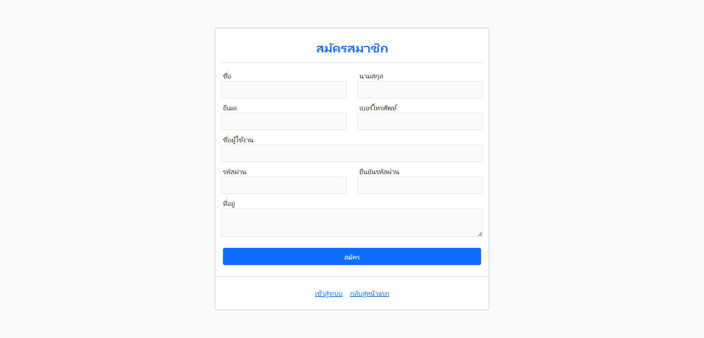
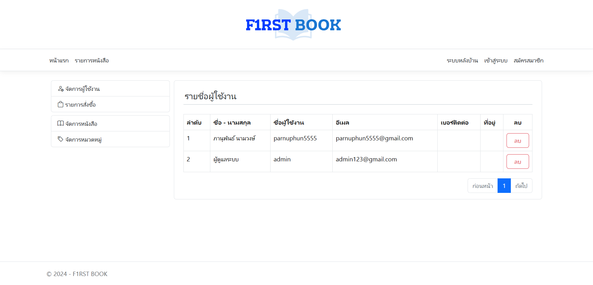
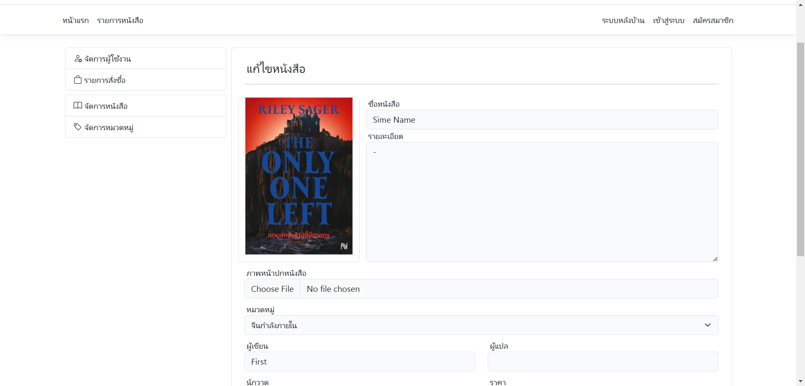

## Book Store Management System
This project is created to learn how to development with ASP.NET Core MVC <br>
**Tech stack** : C#, ASP.NET(8), Bootstrap,  SQL Server, SSMS, Visual Studio<br>
**Packages** : EFCore, EFCore.sqlServer, EFCore.tool

## Futures
- [x] Register / Login
- [x] Account User
- [x] Book Category
- [x] Book
- [ ] Bookmark
- [ ] Cart
- [ ] Order
- [ ] History

## Installation and Setup
1. Run `dotnet --version` to makesure you have aleady installed .NET CORE SDK , If not install first.
2. Run `dotnet restore` to install packages in `.csproject` (Entity Framework Core).
3. Makesure you have aleady install SQL Server and SSMS(Optional).
4. Configure  `ConnectionString` for SQL Server in `./appsetting.json` 
```json
  "ConnectionStrings": {
    "DefaultConnection": "Server=<ServerName>;Database=BookStore;Trusted_Connection=True;TrustServerCertificate=True;"
  }
```
4. Run `dotnet ef database update` to migrate database to SQL Server Or if you use NuGet Console, you can run `update-database` instead.
5. Run `dotnet run` to start project on locallhost.

## Previews
<table>
    <thead></thead>
    <tbody>
        <tr>
            <td>
                
                <center>- Login -</center>
            </td>
            <td>
               
               <center>- Register -</center>
            </td>
        </tr>
        <tr>
            <td>
                
                <center>- Home Page -</center>
            </td>
            <td>
               
               <center>- Book Detail -</center>
            </td>
        </tr>
        <tr>
            <td>
                
                <center>- Account Edit -</center>
            </td>
            <td>
               
               <center>- Users -</center>
            </td>
        </tr>
        <tr>
            <td>
                
                <center>- Book Edit -</center>
            </td>
            <td>
               
               <center>- Categories -</center>
            </td>
        </tr>
    </tbody>
</table>
